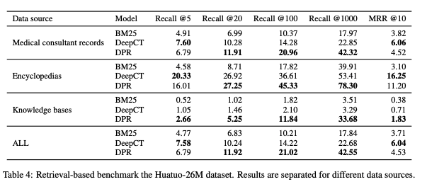
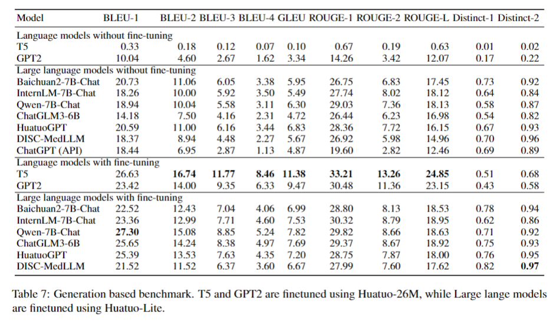
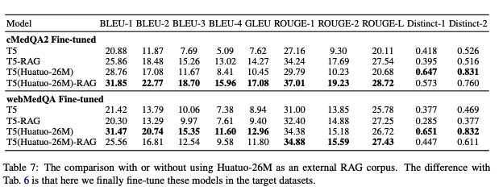
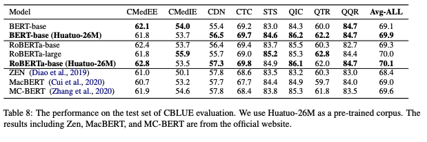
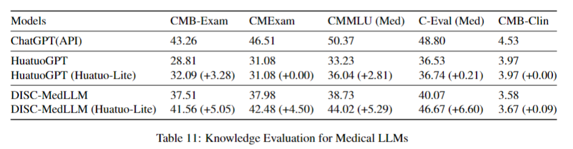

# Huatuo-26M 

<p align="center">
   📃 <a href="https://arxiv.org/abs/2305.01526" target="_blank">Paper</a>  • 🤗 <a href="https://huggingface.co/datasets/FreedomIntelligence/Huatuo26M-Lite" target="_blank">Huatuo-Lite</a> • 🤗 <a href="https://huggingface.co/datasets/FreedomIntelligence/huatuo_encyclopedia_qa" target="_blank">huatuo_encyclopedia_qa</a>  • 🤗 <a href="https://huggingface.co/datasets/FreedomIntelligence/huatuo_knowledge_graph_qa" target="_blank">knowledge_graph_qa</a>  • 🤗 <a href="https://huggingface.co/datasets/FreedomIntelligence/huatuo_consultation_qa" target="_blank">huatuo_consultation_qa</a>  
   <br>  <a href="README.md">   中文</a> | <a href="README_en.md"> English
</p>

## 👩🏻‍⚕Introduction

- Huatuo-26M is currently the largest Chinese medical question-and-answer dataset. This dataset contains over 26 million high-quality medical Q&A pairs, covering various aspects such as diseases, symptoms, treatment methods, and drug information.
- Huatuo-Lite is a refined and optimized dataset based on Huatuo-26M, having undergone multiple purifications and rewrites. It features more data dimensions and higher data quality.


## 📚Data Content

The Huatuo-26M dataset is collected and integrated from multiple sources, including:

- Online Medical Encyclopedia [huatuo_encyclopedia_qa](https://huggingface.co/datasets/FreedomIntelligence/huatuo_encyclopedia_qa)
- Online Medical Knowledge Bases [huatuo_knowledge_graph_qa](https://huggingface.co/datasets/FreedomIntelligence/huatuo_knowledge_graph_qa)
- Online Medical Consultation Records（answer in the form of URLs） [huatuo_consultation_qa](https://huggingface.co/datasets/FreedomIntelligence/huatuo_consultation_qa)
- Streamlined version [Huatuo-Lite](https://huggingface.co/datasets/FreedomIntelligence/Huatuo26M-Lite)


Each question-answer pair in the dataset contains the following fields：

- questions：Problem Description 
- answers：Doctor/Expert Answers
- Huatuo-Lite dataset also includes **Hospital Department** and **Related Diseases** fields


The following is the huatuo test set we used in the paper, which consists of random sampling of data from multiple sources.

- Testdatasets：[huatuo26M-testdatasets](https://huggingface.co/datasets/FreedomIntelligence/huatuo26M-testdatasets)


## 🤖Data Usage

The Huatuo-26M dataset can be used for a variety of AI research and applications in the medical field, such as:

- Natural Language Processing: Including but not limited to Q&A systems, text classification, sentiment analysis, etc.
- Machine Learning model training: Such as disease prediction, personalized treatment recommendation, etc.
- AI applications in the medical field: Such as intelligent diagnosis systems, medical consultation chatbots, etc.


## 🚀Quick Start

To start using the Huatuo-26M dataset, you can follow the steps below:

```python
import datasets
# part 1
knowledge_graph_dataset = datasets.load_dataset('FreedomIntelligence/huatuo_knowledge_graph_qa')
# part 2
encyclopedia_dataset = datasets.load_dataset('FreedomIntelligence/huatuo_encyclopedia_qa')
# part 3 (only url)
consultation_dataset = datasets.load_dataset('FreedomIntelligence/huatuo_consultation_qa')

# testdatasets (6k)
huatuo_testdatasets = datasets.load_dataset('FreedomIntelligence/huatuo26M-testdatasets')
```


## 👩🏻‍🔬Experiment Record

### Benchmark

- Retrieval Evaluation:

  <details><summary>Click to expand</summary>
  
  </details>

- Answer Generation Evaluation:

  <details><summary>Click to expand</summary>
  
  </details>

### Application

- Zero-shot transfer to other QA datasets:

  <details><summary>Click to expand</summary>
  
  </details>

 
- As external knowledge for RAG:

  <details><summary>Click to expand</summary>
  
  </details>


- As pre-training data for language model (LM):

  <details><summary>Click to expand</summary>
  
  </details>


- As fine-tuning data for Medical LLM:

  <details><summary>Click to expand</summary>
  
  </details>


## 🚁License

The Huatuo-26M dataset is licensed under Apache 2.0. Please make sure you have read and agreed to the license terms before using it.


## 📱Contact Us

If you have any questions or need help, please feel free to ask us via email （[xidongw@163.com](mailto:xidongw@163.com)）or in the Issues section.

------


## 😁Citation

```
@misc{li2023huatuo26m,
      title={Huatuo-26M, a Large-scale Chinese Medical QA Dataset}, 
      author={Jianquan Li and Xidong Wang and Xiangbo Wu and Zhiyi Zhang and Xiaolong Xu and Jie Fu and Prayag Tiwari and Xiang Wan and Benyou Wang},
      year={2023},
      eprint={2305.01526},
      archivePrefix={arXiv},
      primaryClass={cs.CL}
}
```
