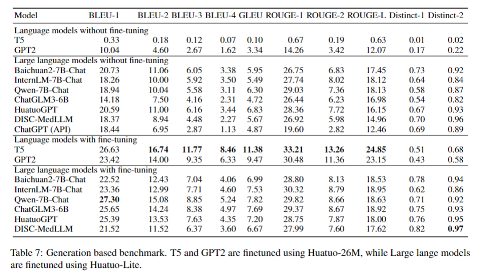

# Huatuo-26M

## 👩🏻‍⚕️项目简介

Huatuo-26M 是目前为止最大的中文医疗问答数据集。此数据集包含了超过2600万个高质量的医疗问答对，涵盖了各种疾病、症状、治疗方式、药品信息等多个方面。Huatuo-26M 是研究人员、开发者和企业为了提高医疗领域的人工智能应用，如聊天机器人、智能诊断系统等，而需要的重要资源。


## 📚数据内容

Huatuo-26M 数据集是由多个来源收集和整合而成，主要包括：

- 在线医疗百科 [huatuo_encyclopedia_qa](https://huggingface.co/datasets/FreedomIntelligence/huatuo_encyclopedia_qa)
- 医疗知识图谱 [huatuo_knowledge_graph_qa](https://huggingface.co/datasets/FreedomIntelligence/huatuo_knowledge_graph_qa)
- 网络上的公开医疗问答论坛（答案为url形式） [huatuo_consultation_qa](https://huggingface.co/datasets/FreedomIntelligence/huatuo_consultation_qa) 


ps: 因为某些原因，数据占比最大的公开医疗问答论坛我们暂时无法公开text格式的数据


数据集中的每个问答对包含以下字段：

- Question：问题描述 
- Answer：医生/专家的答案


以下为我们在论文中使用的huatuo测试集，由多个来源中数据随机抽取组成。

- Testdatasets：[huatuo26M-testdatasets](https://huggingface.co/datasets/FreedomIntelligence/huatuo26M-testdatasets)


## 🤖数据使用

Huatuo-26M 数据集可用于多种医疗领域的人工智能研究和应用，如：

- 自然语言处理：包括但不限于问答系统、文本分类、情感分析等。
- 机器学习模型训练：如预测疾病、个性化治疗推荐等。
- 人工智能在医疗领域的应用：如智能诊断系统、医疗咨询聊天机器人等。


## 🚀快速开始

为了开始使用 Huatuo-26M 数据集，你可以按照以下步骤操作：

```python
import datasets
# part 1
knowledge_graph_dataset = datasets.load_dataset('FreedomIntelligence/huatuo_knowledge_graph_qa')
# part 2
encyclopedia_dataset = datasets.load_dataset('FreedomIntelligence/huatuo_encyclopedia_qa')
# part 3 (only url)
consultation_dataset = datasets.load_dataset('FreedomIntelligence/huatuo_consultation_qa')

# testdatasets (6k)
huatuo_testdatasets = datasets.load_dataset('FreedomIntelligence/huatuo26M-testdatasets')
```


## 👩🏻‍🔬实验记录


- #### 检索实验：


- #### NLG实验：





- #### Zero-shot对比实验：


- #### RAG实验：


- #### CBLUE实验：

#### 


## 🚁许可

Huatuo-26M 数据集遵循 Apache 2.0 许可。使用前请确保你已阅读并同意许可条款。


## 👷🏻‍♂️贡献

我们欢迎并感谢所有的贡献！如果你发现数据集中的问题，或者有新的想法和建议，欢迎通过 Issues 或者 Pull Requests 与我们交流。


## 📱联系我们

如果你有任何问题或者需要帮助，欢迎通过电子邮件（[anon2010@163.com](mailto:anon2010@163.com)）或者在 Issues 区向我们提问。

------

该项目以中国古代著名医学家华佗的名字命名，反映了我们致力于推动医学知识和技术进步的发心。


## 😁引用

```
@misc{li2023huatuo26m,
      title={Huatuo-26M, a Large-scale Chinese Medical QA Dataset}, 
      author={Jianquan Li and Xidong Wang and Xiangbo Wu and Zhiyi Zhang and Xiaolong Xu and Jie Fu and Prayag Tiwari and Xiang Wan and Benyou Wang},
      year={2023},
      eprint={2305.01526},
      archivePrefix={arXiv},
      primaryClass={cs.CL}
}
```